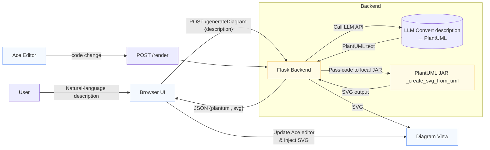

# System Patterns: AI Assistant for PlantUML Interactive Editor

## System Architecture

The AI Assistant feature integrates into the existing Flask-based backend and JavaScript frontend. The core principle is to leverage the LLM for PlantUML code generation while maintaining the existing local PlantUML JAR for SVG rendering.

## Key Technical Decisions

-   **LLM Integration:** A dedicated Python module (`assistant.py`) will encapsulate all LLM interaction logic, making it easy to swap LLM providers in the future.
-   **Local Rendering Preservation:** The `_create_svg_from_uml` function (which invokes the local PlantUML JAR) will be reused for AI-generated code, ensuring no diagram data leaves the local environment.
-   **API Endpoint:** A new Flask endpoint (`/generateDiagram`) will handle the AI generation request, separating it from the existing `/render` endpoint.
-   **Frontend-Backend Communication:** JSON will be used for data exchange, similar to existing patterns. The frontend will receive both the generated PlantUML code and the SVG.

## Design Patterns in Use

-   **Facade Pattern:** The `assistant.py` module acts as a facade for the LLM API, simplifying its use for the Flask application.
-   **Command Pattern:** The "Generate Diagram" button triggers a command (API call) that encapsulates the complex LLM interaction and rendering logic.
-   **Observer Pattern (Implicit):** The frontend "observes" the response from the backend and updates the UI (Ace editor and diagram view) accordingly.

## Component Relationships

-   **Frontend (JavaScript/HTML):** Responsible for user input, displaying loading states, sending requests to the backend, and rendering the received SVG/PlantUML.
-   **Flask Backend (`app.py`):** Routes requests, orchestrates calls to `assistant.py` and `render.py`, and handles responses.
-   **LLM Assistant (`assistant.py`):** Interacts with the external LLM API to convert natural language to PlantUML.
-   **PlantUML Renderer (`render.py`):** Contains the `_create_svg_from_uml` function, which interfaces with the local PlantUML JAR.

## Critical Implementation Paths

-   **Secure LLM API Key Handling:** The LLM API key must be loaded from environment variables and never exposed to the client.
-   **Robust Error Handling:** The system must gracefully handle LLM API errors, network issues, and PlantUML syntax errors, providing clear feedback to the user.
-   **Rate Limiting:** Implement server-side rate limiting to prevent abuse and manage LLM costs.
-   **Prompt Engineering:** The prompt template for the LLM is crucial for generating accurate and valid PlantUML code.
