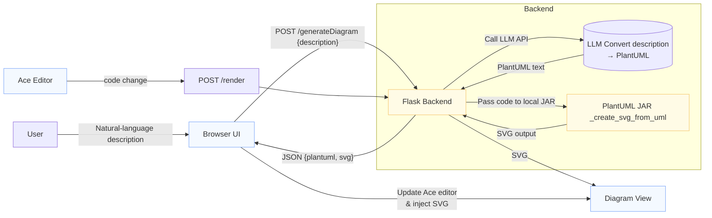

# Architecture Diagram

```mermaid

flowchart LR
    %% --- 1. User triggers AI generation ---
    U[User] -- "Natural‑language description" --> B1[Browser UI]
    B1 -- POST /generateDiagram {description} --> BE[Flask Backend]

    %% --- 2. Backend: LLM conversion ---
    subgraph Backend
        BE -- Call LLM API --> LLM[(LLM Convert description\n → PlantUML)]
        LLM -- PlantUML text --> BE
        BE -- Pass code to local JAR --> JAR[PlantUML JAR _create_svg_from_uml]
        JAR -- SVG output --> BE
    end

    %% --- 3. Response to frontend ---
    BE -- JSON {plantuml, svg} --> B1
    B1 -- Update Ace editor<br/>& inject SVG --> DGM[Diagram View]

    %% --- 4. Normal live‑render loop (unchanged) ---
    ACE[Ace Editor] -- code change --> RenderReq[POST /render]
    RenderReq --> BE
    BE -- SVG --> DGM

    %% --- Notes ---
    classDef io fill:#f4f9ff,stroke:#7fa8f8,stroke-width:1px;
    class B1,ACE,DGM io
    classDef backend fill:#fffbe6,stroke:#f5c76e,stroke-width:1px;
    class BE,JAR backend

```

